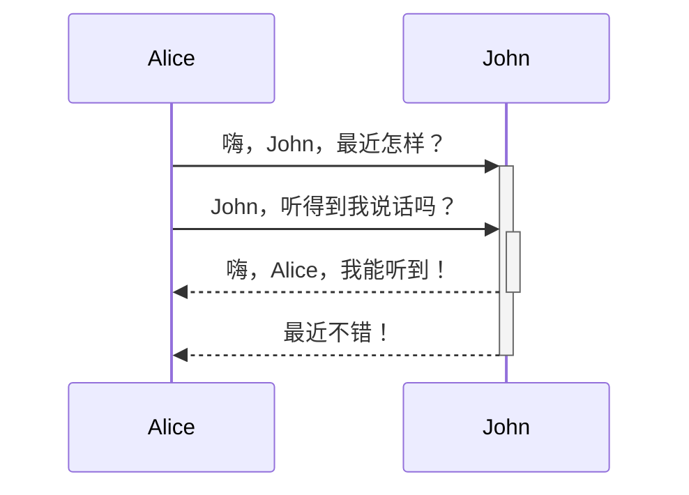

Obsidian 是一个基于 Markdown 进行记录的知识库软件。

目前 Obsidian 支持的格式如下：

---

### 内部链接

通过`[[]]`来链接库中任意一个文件。

```md
链接一篇笔记：[[内部链接]]。
```

链接一篇笔记：[[内部链接]]。

---

### 嵌入文件

在笔记中插入其他文件（更多细节请阅读[[嵌入文件]]）。这里将演示如何插入一篇笔记的某个章节：

```md
![[Obsidian#什么是 Obsidian]]
```

![[Obsidian#什么是 Obsidian]]

---

### 小标题

```md
# 这是小标题 1
## 这是小标题 2
### 这是小标题 3 
#### 这是小标题 4
##### 这是小标题 5
###### 这是小标题 6
```

# 这是小标题 1
## 这是小标题 2
### 这是小标题 3 
#### 这是小标题 4
##### 这是小标题 5
###### 这是小标题 6

---

### 强调

```md
*这是斜体示例*
_这是斜体的另一种写法_
```

*这是斜体示例*
_这是斜体的另一种写法_

```md
**这是粗体示例**
__这是粗体的另一种写法__
```

**这是粗体示例**
__这是粗体的另一种写法__

```md
_你也**可以**将它们配合使用_
```

_你也**可以**将它们配合使用_

---

### 列表

```md
- 项目 1
- 项目 2
	- 项目 2a
	- 项目 2b

1. 项目 1
1. 项目 2
1. 项目 3
   1. 项目 3a
   1. 项目 3b
```

无序列表：
- 项目 1
- 项目 2
	- 项目 2a
	- 项目 2b

有序列表：
1. 项目 1
1. 项目 2
1. 项目 3
	1. 项目 3a
	2. 项目 3b

--- 

### 图片

```md

```


#### 调整图片大小

比如，将上面的示例图片调整为100像素宽：

```md

```


---

### 其他链接

#### 外部链接

Markdown 风格的链接既可以用来指向网页这类外部对象，也可以用来指向库中的笔记或者图片。

```md
http://obsidian.md - automatic!
[Obsidian](http://obsidian.md)
```

http://obsidian.md - 自动化!
[Obsidian](http://obsidian.md)

#### Obsidian URI

[[使用 Obsidian URI|Obsidian URI]] 可以让你在其他应用或 Obsidian 的其他库中打开当前库的某篇笔记。

比如，你可以通过以下方式跳转到某个库中的某篇笔记（请注意 [[使用 Obsidian URI#编码|URI 的编码]]）：

```md
[打开某篇笔记](obsidian://open?path=D:%2Fpath%2Fto%2Ffile.md)
```

[打开某篇笔记](obsidian://open?path=D:%2Fpath%2Fto%2Ffile.md)

除了通过笔记的地址来链接笔记外，你也可以通过笔记所在的库名称以及笔记名称来链接该笔记：

```md
[打开某篇笔记](obsidian://open?vault=MainVault&file=MyNote.md)
```

[打开某篇笔记](obsidian://open?vault=MainVault&file=MyNote.md)

#### 转义

如果 url 中含有空格的话，空格需要转义为 `%20`，如：

```md
[Export options](Pasted%20image)
```

[Export options](Pasted%20image)

当然，你也可以用 `<>` 将空格包含起来，如：

```md
[Slides Demo](<Slides Demo>)
```

[Slides Demo](<Slides Demo>)

---

### 引用

```md
> Human beings face ever more complex and urgent problems, and their effectiveness in dealing with these problems is a matter that is critical to the stability and continued progress of society.

\- Doug Engelbart, 1961
```

> Human beings face ever more complex and urgent problems, and their effectiveness in dealing with these problems is a matter that is critical to the stability and continued progress of society.

\- Doug Engelbart, 1961

---

### 行内代码

```md
一行中被 `反引号` 括起来的文字会以代码格式显示。
```

一行中被 `反引号` 括起来的文字会以代码格式显示。

---

### 代码块

Obsidian 会将六个反引号括起来的内容识别为代码块，并将其按代码格式显示。代码块支持语法高亮功能，你可以在代码块的第一行（即开头处的反引号后）声明语言来使用特定的语法高亮。

代码块的语法高亮实际是使用 prismjs 来实现的，因此你可以到[他们的网站](https://prismjs.com/#supported-languages) 来查看其支持的语言。

<pre><code>```js
function fancyAlert(arg) {
  if(arg) {
    $.facebox({div:'#foo'})
  }
}
```</code></pre>

```js
function fancyAlert(arg) {
  if(arg) {
    $.facebox({div:'#foo'})
  }
}
```

```md
    如果你使用 Tab 键对段落进行缩进，这段文本在预览模式下也会被识别为代码块。
```

	
	如果你使用 Tab 键对段落进行缩进，这段文本在预览模式下也会被识别为代码块。
	
---

### 任务列表

```md
- [x] 支持 #标签 ，[链接]()，**样式**
- [x] 要求包含列表标志（有序表无序表均可，比如 `1.[x]` 同样可以）
- [x] 这是一个已经完成的项目
- [?] 这也是一个已完成的项目（实际上你可以在其中使用任何字符）
- [ ] 这是一个未完成的项目
- [ ] 在预览模式下单击选框可以切换项目完成状态
```

- [x] 支持 #标签 ，[链接]()，**样式**
- [x] 要求包含列表标志（有序表无序表均可，比如 `1.[x]` 同样可以）
- [x] 这是一个已经完成的项目
- [?] 这也是一个已完成的项目（实际上你可以在其中使用任何字符）
- [ ] 这是一个未完成的项目 
- [ ] 在预览模式下单击选框可以切换项目完成状态

---

### 表格

你可以使用 `-` 来分割表格的标题行和内容行，使用 `|` 来指定不同的列：

```md
| 标题1          | 标题2          |
| -------------- | -------------- |
| 单元格11的内容 | 单元格12的内容 |
| 单元格21的内容 | 单元格22的内容 |
```

| 标题1          | 标题2          |
| -------------- | -------------- |
| 单元格11的内容 | 单元格12的内容 |
| 单元格21的内容 | 单元格22的内容 |

---

| 列宽可以通过冒号来进行调整 | 这样你就可以在标题行中输入长标题 |
| :------------------------- | -------------------------------: |
| 因为 `:` 的存在            |             不同列将有不同的列宽 |

你可以在表格中添加链接，因为链接能在表格中正确显示。但如果你的链接中包含 `|`，则需要对其进行转义（用 `\|` 代替 `|`），以防止链接中的竖线被错误识别为列分隔符。

如果你在列表中添加链接，他们可以正常的显示与使用。但如果使用的是竖线链接，则需要在竖线前面加上 `\` 来进行转义，防止表格错乱。

```md
| 标题1                      | 标题2              |
| -------------------------- | ------------------ |
| [[格式化你的笔记\|格式化]] | [[快捷键\|快捷键]] |
```

| 标题1                      | 标题2              |
| -------------------------- | ------------------ |
| [[Obsidian 帮助文档\|格式化]] | [[使用快捷键\|快捷键]] |

---

### 删除线

```md
在文字两端加上波浪线将会显示为删除效果，比如~~这样~~。
```

在文字两端加上波浪线将会显示为删除效果，比如~~这样~~。

---

###  高亮

```md
使用两个等号来对文本进行高亮==文本==。
```

使用两个等号来对文本进行高亮==文本==。

---

### 脚注

```md
H脚注的用法很简单，只需要在段落中需要插入脚注的地方标注一个符号，再在段落后对这个符号进行解释即可。比如这是一个简单的脚注，[^1] 这是一个长一些的脚注。[^长脚注]

[^1]: 很有用！
[^长脚注]: 这是一个可以写长段落或者代码的地方。
	
	你可以使用缩进在脚注中纳入其他段落。
	
	`{ 代码 }`

	这样你就可以在脚注中添加任意数量的段落了。
```

脚注的用法很简单，只需要在段落中需要插入脚注的地方标注一个符号，再在段落后对这个符号进行解释即可。比如这是一个简单的脚注，[^1] 这是一个长一些的脚注。[^长脚注]

[^1]: 很有用！
[^长脚注]: 这是一个可以写长段落或者代码的地方。
	
	你可以使用缩进在脚注中纳入其他段落。
	
	`{ 代码 }`

	这样你就可以在脚注中添加任意数量的段落了。
	
你也可以使用行内脚注。^[请注意符号^需要在方括号外]

### 数学公式

```md
$$\begin{vmatrix}a & b\\
c & d
\end{vmatrix}=ad-bc$$
```

$$\begin{vmatrix}a & b\\
c & d
\end{vmatrix}=ad-bc$$

你也可以像这样 $e^{2i\pi} = 1$ 使用行内公式。

这里的公式使用的是 LaTeX 语法，你可以到相应网站了解更多相关信息。

### 注释

所谓注释，指的是会在编辑模式中显示，但不会在预览模式中显示的内容。使用 `%%` 可以将内容变为注释。以下为语法：

```md
这里是行内注释：%%预览模式下你将看不到这句话%%

这里是跨行注释：
%%
所谓跨行
就是可以有很多行
%%
```

以下为示例：

这里是行内注释：%%预览模式下你将看不到这句话%%

这里是跨行注释：
%%
所谓跨行
就是可以有很多行
%%

### 图表

Obsidian 通过 [Mermaid](https://mermaid-js.github.io/) 及其所提供的[编译器](https://mermaid-js.github.io/mermaid-live-editor)来为用户提供图表的绘制功能。

<pre><code>```mermaid
sequenceDiagram
    Alice->>+John: 嗨，John，最近怎样？
    Alice->>+John: John，听得到我说话吗？
    John-->>-Alice: 嗨，Alice，我能听到！
    John-->>-Alice: 最近不错！
```</code></pre>



## 开发小记

总的来说，我们在努力让 Obsidian 的语法不偏离正统的 Markdown 语法太多。总的来看，Obsidian 的语法大多还是基于 CommonMark，包括了一些 GitHub Flavored Markdown（GFM）和 LaTeX，以及我们特有的嵌入文件语法。


# 标签的使用
标签是一个组织大量笔记的好方法，它能让你更容易找到笔记。标签本质上是一个可点击的检索按钮，点击它 Obsidian 就会自动为你搜索包含这个标签的笔记。比如，点击 #标签 这个标签后，Obsidian 将会显示库中所有包含这个标签的笔记。标签有各种不同的用法，比如标明笔记的来源或是笔记的种类。Zettelkasten 方法的使用者则会将标签作为连接笔记、连接想法的“切入点”。总而言之，这是一个非常灵活的功能，我们相信你可以把它玩出花儿来。

## 标签面板

如果你启用了[[标签面板]]，那么你将看到一个包含了所有笔记的标签的列表。这个列表将会按照标签的使用频次来排序。点击任意一个标签即可激活相应的搜索。

## 嵌套标签

如果你想要使用嵌套标签，可以使用这样的格式：

#maintag/subtag 

其中 `maintag` 为主标签，subtag 为子标签。当你在标签面板中开启了 `显示嵌套标签` 选项后，你就可以看到以层级形式显示的嵌套标签。

嵌套标签可以像一般标签一样通过点击来唤起搜索。并且，嵌套标签允许你选择搜索的层次。比如，你可以仅搜索 `maintag` 这个主标签，从而找到包含任意一个子标签的笔记。所以，当你在一个主分类下设置了多个子分类，但又想找到这个主分类包含的内容时，这个功能就十分有用。

## 可使用的字符

标签中不允许使用空格。所以，如果你想区分标签中的词语，你可以使用以下格式：

- 使用驼峰式大小写: #TwoWords
- 使用下划线： #two_words
- 使用破折号： #two-words

总的来说，标签只允许以下符号：

1. `_` 下划线和 `-` 破折号
2. 用于[[标签的使用#嵌套标签|嵌套标签]]的 `/` 斜杠


标签允许使用数字，==但标签不能完全由数字组成==。比如，`#1984` 就不是一个符合语法的标签。


# 反向链接的使用

反向链接是 Obsidian 最有用的功能之一。然而，在某些情况下，你可能会对它感到困惑。以下是一些你可能用得上的说明。

反向链接面板由两大部分组成，`链接当前文件` 和 `提到当前文件名`。

![[反向链接.png]]

以[[反向链接]]这篇笔记为例。如你所见，在这篇笔记的反向链接面板中，每个部分都有许多笔记。在 `链接当前文件` 这个部分，你可以发现我在[[多笔记协同]]这篇笔记中链接了这篇笔记。同时，你也可以发现，在 `提到当前文件名` 这个部分，我在[[基本笔记记录]]这篇笔记中提到了这篇笔记但并没有进行链接。

这是一个非常强大的功能，它能让你更好地了解笔记之间的联系，即使是那些你先前并没有发现的联系。举个例子，假设你以某个概念为名写了一篇笔记。这样，当其他笔记提到这个概念时，Obsidian 会让你轻松地发现哪些笔记提到了这个概念，从而让你能够挖掘不同想法间潜在关联，新的想法也就能由此产生。

如果你想让那些“提到当前标题”的笔记链接当前笔记的话，只需要让鼠标悬停在那些笔记上，再点击 `转为内部链接` 按钮即可。点击这个按钮会自动地为这些标题加上方括号，从而将其转换为内部连接。

你也可以在面板右上角的 `更多选项` 按钮中点击 `打开反向链接面板` 选项，从而打开一个独立的反向链接面板（或者你也可以使用[[命令面板]]来完成这一操作）。这个面板是与当前笔记[[关联面板|同步]]的。你也可以取消同步。同时，这个面板也如[[面板布局]]中所描述那般，可以随意拖动。


# 管理附件

## 添加附件

你可以通过以下几种方式添加附件到库中：

1. 复制附件，在 Obsidian 中直接粘贴。
2. 拖拽。
3. 下载或复制附件到库文件夹中。

添加到库中的附件和 Obsidian 中的其他文件无异，并且还是可以通过系统资源管理器访问。

需要注意的是，以上方法目前仅支持[[支持格式| Obsidian 支持的格式]]。

## 复制、在 Obsidian 中粘贴

你可以将本地文件复制后，直接在 Obsidian 界面中粘贴，这样文件就会自动保存到库中。

这对保存截图非常有用。一般截图软件都会把截图写入剪贴板中，因此你可以直接在笔记中粘贴截图，截图文件也会直接保存到库里。

## 拖拽

你可以将文件从系统资源管理器（或是网页上的图片）拖拽到 Obsidian 中，这样文件也能复制到当前库中。

## 下载或复制附件到库文件夹中

这种方式可以与[[捕获信息#使用剪藏插件|剪藏插件]]配合使用。

当然，你也可以直接将附件下载到库文件夹中。

## 更改默认附件位置

默认情况下，新附件会存放在库的根目录中。你可以在 `设置` -> `文件与链接` -> `新附件的默认位置` 中修改附件的默认位置。

### 将附件存放到某个文件夹下

你可以选择一个固定不变的文件夹作为新附件的默认存放位置。如果你想这样做的话，在 `新附件的默认位置` 设置中选择 `下方指定的文件夹`，然后选择一个文件夹即可。除了以上这种方式外，你也可以直接在[[文件列表]]中选择一个文件夹，然后右键点击它，在弹出的菜单中选择 `将其设置为附件文件夹`。

除此之外，你可能会想将新附件保存到当前笔记所在的文件夹里。要做到这点，在 `新附件的默认位置` 设置中选择 `当前打开文件所在的文件夹` 即可。

### Under the current folder

除了保存在 `当前打开文件所在的文件夹` 外，你还可以让附件保存在当前文件所在的文件夹下的某一子文件夹中。这个子文件夹并不需要存在，因为当它不存在时，Obsidian 会帮你创建它。

比如，你指定该子文件夹为 `assets`，如果当前文件保存在 `path` 文件夹下时，附件就会保存到 `path` 文件夹下的 `assets` 文件夹中；如果当前文件保存在 `path2` 文件夹下时，附件就会保存到 `path2` 文件夹下的 `assets` 文件夹中。

```
- path文件夹
	- 笔记1
	- assets
		- 笔记1的附件
- path2文件夹
	- 笔记2
	- assets
		- 笔记2的附件
```

做到这点，你只需要在 `新附件的默认位置` 设置中选择 `当前文件夹下指定的子文件夹中`，并输入子文件夹名称即可。

# 块链接与块引用

在 0.9.5 或更高的版本中，除了[[内部链接#链接标题|链接到标题]]外，你还可以进行块链接与块引用。

## 什么是块

一个块可以是一个段落、一个引用、一个列表等等。一般来说，前后有空行包围的东西就是块。 ^dcf64c

## 块链接

链接某个笔记文件中的块，你首先需要输入 `[[文件名` 来唤起弹窗，在选择相应的文件后，通过输入 `^` 进入块选择界面。随后，你需要继续输入关键词来选择你所需要链接的块。

选择好了以后，按下回车键，对于该块的链接就创建好了。块链接会以 `[[filename#^dcf64c]]` 的形式出现，其中 `dcf64c` 则是你所链接的块的 ID。

如果你忘了想链接的块在哪个文件里，你可以通过输入 `[[^^` 在库的所有笔记文件中查找该块。由于这种查找方式涉及库中所有笔记文件，当你的库很大时，查找就需要花费一些时间。

比如，[[块链接与块引用#^dcf64c]]可以链接到前文的段落。


## 块引用

与[[嵌入文件]]一样，你可以通过在块链接前加上 `!` 来进行块引用，即块的嵌入。

比如：

![[块链接与块引用#^dcf64c]]

## 手动创建块 ID

如果你想手动创建可读性强的块 ID，你可以在块的末尾手动加上 `^你的-id` 这样的语法。需要注意的是，对于一般的段落，手动创建的 ID 和块最后一个字符（即段落最后一个字符）间需要有一个或多个空格。

如果想为表格这样比较复杂的块手动创建 ID，你需要将手动创建的 ID 放置在该块之后，同时确保手动创建的块 ID 前后都是空行。

比如：

```

| header1 | header2 |
| ------- | ------- |
| 1       | 2       |

^Obsidian

```

| header1 | header2 |
| ------- | ------- |
| 1       | 2       |

^Obsidian

![[#^Obsidian]]

当你手动创建了块 ID 后再链接或引用该块时，Obsidian 会自动使用你手动创建的块 ID 而不是随机生成的块 ID。

需要注意的是，手动创建的块 ID 仅支持字母、数字、破折号。

## 迁移性

请注意，块链接和块引用并非 Markdown 的标准语法，而是带有 Obsidian 风格的 Markdown 语法。这意味着这些链接和引用将在其他软件中失效。

不过，尽管如此，只要你的软件支持文件内容的全局搜索，你还是可以通过搜索块 ID 来查找链接或引用的块。块链接与块引用本身包含的链接信息是不会丢失的，只不过你想在其他软件中利用它们会麻烦一点。


# 内部链接

在 Obsidian 中，内部链接是你知识网络的重要组成部分。所谓内部链接指的是从库中某篇笔记出发，指向库中其他文件的链接。反之，如果是从库中某篇笔记指向库外的文件、网页，则为外部链接。

## 链接文件

创建内部链接非常简单，只需要输入 `[[`，并从弹出的列表里选择自己需要链接的文件即可。你可以通过上下方向键或输入关键词来选择文件，当所需文件被选中（高亮）时按下回车键即可完成链接。

## 链接标题

笔记文件一般都有标题。因此，除了链接整篇笔记外，你也可以单独链接到笔记的某个标题。链接到标题的步骤非常简单，首先还是输入 `[[`，并通过方向键选择所需链接的笔记。当该笔记被选中（高亮）时，按下 `#`（即 `shift-3`）来代替回车键。此时，弹出的列表将显示该笔记中的标题。然后，你可以通过上下方向键或输入关键词来选择所需链接的标题。当然，如果这个标题下还有更小的标题的话，你可以继续通过按下 `#` 来查看。当你选中了你想链接的标题后，按下 `Enter` 完成链接。

在预览模式下，内部链接可以显示为其他文字。要实现这点，只需通过 `|` 来修饰内部链接。比如，[[另一篇笔记名称|预览模式下显示的自定义字段]]。这可以与链接标题语法一起使用，比如[[折叠#举个例子|举个折叠的例子]]。

## 打开链接

- 在预览模式下，点击内部链接即可在当前面板打开链接
- 在预览模式下，如果想在新面板中打开链接，则需按住 `Ctrl/Cmd` 再点击内部链接
- 在编辑模式下，按住 `Ctrl/Cmd` 点击内部链接即可在当前面板打开链接
- 在编辑模式下，如果想在新面板中打开链接，则需按住 `Ctrl/Cmd+Shift` 再点击内部链接
- 如果想预览链接内容，但又不想离开当前笔记，则可以打开[[页面预览]]插件。这样，鼠标悬停在内部链接上时，你就可以通过一个小弹窗来预览链接中的内容。

# 嵌入文件

你可以将图片或者音频等附件嵌入到你的笔记中。嵌入文件的语法为 `![[文件名.png]]`，例如：

![[Engelbart.jpg]]

![[Excerpt from Mother of All Demos (1968).ogg]]

你可以通过相同的语法将 PDF 文件嵌入到你的笔记中。除此之外，你可以通过 `![[My File.pdf#page=number]]` 这样的形式直接指定嵌入 PDF 文件的页码。

当你拖动图片到笔记中时，图片会自动嵌入笔记，并且 Obsidian 会将图片文件复制到默认的附件文件夹中。Obsidian 支持几种图片格式，因此大多数情况下你都可以在文件列表中的附件文件夹中选择并查看图片。

## 嵌入笔记

当然，你可以通过相同的语法将一篇笔记嵌入到另一篇笔记中，比如：

![[支持格式]]

## iframe

由于 Markdown 兼容 HTML，因此你可以使用“iframe”将网页嵌入到笔记中。

比如：

```html
<iframe src="https://www.bilibili.com/"></iframe>
```

具体应用起来是这样的效果：

<iframe src="https://www.bilibili.com/"></iframe>

使用 iframe 嵌入网页的基本语法为：

```html
<iframe src="网页地址"></iframe>
```

一些网站并不允许你直接嵌入它们的页面。比如，你就不能通过 YouTube 视频页面的 URL 来嵌入该页面。但是，这些网站一般都提供了用于嵌入的 URL，比如你可以通过 `https://www.youtube.com/embed/VIDEO_ID` 这样的专用 URL 来嵌入 YouTube 的视频页面。

如果你想嵌入一个网站，可以尝试在搜索引擎上 `{网页名} 嵌入 iframe` 等关键词，这样能帮助你更快速的嵌入某个网站。

比如，你可以利用搜索结果给出的代码快速插入 Twitter：

```html
<iframe
	border=0
	frameborder=0
	height=250
	width=550  
	src="https://twitframe.com/show?url=https%3A%2F%2Ftwitter.com%2Fjack%2Fstatus%2F20">
</iframe>
```

实现效果：（国内可能需要科学上网）

<iframe border=0 frameborder=0 height=250 width=550  
 src="https://twitframe.com/show?url=https%3A%2F%2Ftwitter.com%2Fjack%2Fstatus%2F20"></iframe>

--- 

### 开发小记

这个语法实际受到了 Markdown 相关语法的启发：
1. 在 Markdown 中，`[Image](link.png)` 可以让链接指向图片，而 `` 能让图片嵌入到当前文档中。
2. 而[[内部链接]]的语法则基于以下设定：`[[My page]]` 是 `[My page](My page)` 的一个便捷写法（或者是“语法糖”）。

综上，我们可以得到 `![[My page]]` 应该等效于 ``。

当然，我们也可以使用其他形式的语法。比如，Roam Research 的嵌入语法为 `{{embed: ((NODE_ID))}}`。我们曾经想过使用 `((Page name))` 这样的形式来表示嵌入，但后来我们认为还是 `![[Page name]]` 的形式能更好地与其他语法保持一致，便于记忆，同时也能减少符号的占用，让其他符号能够表示其他含义。

### 调整嵌入的图片大小

你可以通过以下语法调整嵌入到笔记中的图片的大小：

Markdown 风格的嵌入，使用 `` 这样的语法。

一般的嵌入，使用 `![[image.png|100x100]]` 这样的语法。

如果要根据图像的宽高比例进行缩放，请省略高度，如 `![[image.png|100]]`。

# 为笔记添加别名

---
aliases: 别名
---

有时，一则笔记可能在不同语境中有不同的名字。这就是我们所说的“别名”。

比如，你可能会用完整的姓名、简单的名字或使用绰号来称呼你的朋友。再比如，你可能会使用缩写“AI”来指代特定的术语“artificial intelligence”。特别是对于一些外来名词，我们会使用自己的母语来称呼它，这样我们在记录笔记时会更加方便。

### 设置笔记的别名

从 0.9.16 开始，你可以在笔记的 [[YAML front matter]] 中设置笔记的别名。例如：

```
---
aliases: [AI, Artificial Intelligence]
---
```

请注意，Front matter 需要放在笔记开头才能生效。同时，`aliases` 需要使用英文。

未来，我们会考虑采取更友好的方式来让用户使用、管理别名，而不是让用户手动在笔记的 Front matter 中输入。

### 链接别名

一旦你为笔记设置了别名，你就可以通过 `[[别名]]` 的方式来引用这篇具有多个名称的笔记。引用时，对话框中会显示重定向标志，如下图所示：

![[使用别名进行链接.png]]

按下回车后，插入的链接会这样显示：`[[笔记原名称|别名]]`。

可以发现，Obsidian 并没有直接以 `[[别名]]` 的方式插入链接，而是用别名对原标题进行了修饰，这样别的软件也能轻松识别你链接了别名的笔记。

### 提到当前标题

当你为某一笔记设置别名后，其他笔记无论是提到当前笔记的原标题还是别名，都会在 `提到当前标题` 中显示。

比如，当你为一篇名为“人工智能”的笔记设置了“AI”这个别名后，你就可以在[[反向链接]]中找到其他提到了“AI”的笔记，从而将“人工智能”这篇笔记与这些笔记链接起来。当你点击 `转为内部链接` 按钮后，这些笔记中的“AI”就会被替换为 `[[人工智能|AI]]` 这样的链接。
